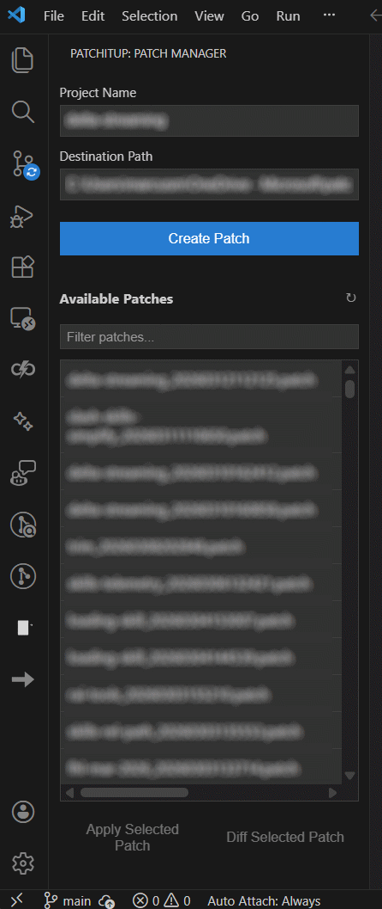

# PatchItUp

**Seamlessly create and apply git patches for local repositories, GitHub Codespaces, and remote development environments.**

PatchItUp is a VS Code extension that makes it easy to create git patches from uncommitted changes in any git repository. Whether you're working locally, in GitHub Codespaces, WSL, Dev Containers, or over SSH, PatchItUp provides an intuitive sidebar UI to create, save, and apply patches - perfect for backing up work-in-progress or transferring changes between environments.

## ✨ Features

- **📦 Create Patches** - Generate git patches from uncommitted changes in any git repository
- **💾 Save Patches** - Patches are saved to your configured destination path
- **📋 Apply Patches** - Select and apply any saved patch back to your working directory
- **🔍 Diff Patches** - Preview what a patch would change (opens diff tabs without modifying your repo)
- **🌐 Works Everywhere** - Supports local repos, GitHub Codespaces, WSL, Dev Containers, and SSH remotes
- **🎯 Sidebar UI** - Intuitive panel in the activity bar for easy access
- **🔄 Automatic Refresh** - Patch list updates automatically after creating new patches
- **⏰ Timestamp Names** - Patches named with project and timestamp: `projectname_YYYYMMDDHHMMSS.patch`
- **📁 Browse Patches** - See all your patches in a sortable list (newest first)
- **⚙️ Configurable** - Set source directory, project name, and destination path

## 🖼️ Screenshots



*The PatchItUp panel showing configuration fields and available patches, allowing for creating and applying patches.*

## 🚀 Quick Start

1. **Install the extension** in VS Code
2. **Open the PatchItUp panel** - Click the diff icon in the activity bar (left sidebar)
3. **Configure settings:**
   - **Source Directory**: Your git repository path (e.g., `/workspaces/your-project` or `C:\Projects\my-app`)
   - **Project Name**: `my-project` (used in patch filenames)
   - **Destination Path**: Where to save patches (e.g., `C:\Users\YourName\patches`)
4. **Make changes** in your repository
5. **Click "Create Patch"** - Patch is saved to your destination path
6. **Apply patches** - Select a patch from the list and click "Apply Selected Patch"

## 📖 Usage

### Creating Patches

1. Make changes to files in your git repository (don't commit them)
2. Open the PatchItUp panel from the activity bar
3. Click **Create Patch**
4. The patch is saved to your destination path with format: `projectname_YYYYMMDDHHMMSS.patch`

### Applying Patches

1. Open the PatchItUp panel
2. Select a patch from the **Available Patches** list
3. Click **Apply Selected Patch**
4. The patch is applied to your source directory

### Diffing (Previewing) Patches

1. Open the PatchItUp panel
2. Select a patch from the **Available Patches** list
3. Click **Diff Selected Patch**
4. PatchItUp creates a temporary working copy of the affected files, applies the patch there, and opens diff editors for the changed files

Notes:
- Temp location is the extension-host temp directory (`%TEMP%` on Windows, `/tmp` on Linux remotes).
- This does **not** modify your working directory.
- If the patch was created from a different repo/branch/history than your current `Source Directory`, PatchItUp may fall back to a best-effort preview (some hunks may be rejected).

### Command Palette

You can also use the command palette (Ctrl+Shift+P):
- `PatchItUp: Create and Save Patch`
- `PatchItUp: Open Panel`

## ⚙️ Configuration

Configure the extension in VS Code settings (File > Preferences > Settings):

### `patchitup.sourceDirectory`
- **Description**: Git repository directory to create patches from
- **Default**: `/tmp`
- **Examples**:
  - Codespace: `/workspaces/my-project`
  - Windows: `C:\Projects\my-project`
  - WSL/Linux: `/home/user/projects/my-project`

### `patchitup.projectName`
- **Description**: Project name prefix for patch files
- **Default**: `project`
- **Example**: `my-app`

### `patchitup.destinationPath`
- **Description**: Local path on host machine to save patches
- **Default**: `` (empty - must be configured)
- **Windows Example**: `C:\Users\YourName\patches`
- **Mac/Linux Example**: `/Users/YourName/patches`

## 🔧 Requirements

- VS Code 1.85.0 or higher
- Git installed in your development environment
- Write access to the destination path

## 🌐 Supported Environments

- **Local Development** - Works with any local git repository
- **GitHub Codespaces** - Create patches in Codespaces and save to your local machine
- **WSL** - Full support for Windows Subsystem for Linux
- **Dev Containers** - Works inside development containers
- **SSH Remote** - Works when connected to remote machines via SSH

## 🎯 Use Cases

- **Backup WIP**: Save work-in-progress before switching branches or closing your environment
- **Transfer Changes**: Move changes between environments (Codespaces, local, WSL, etc.)
- **Code Review**: Create patches for reviewing changes offline or in different contexts
- **Experimentation**: Try changes and easily revert by applying a previous patch
- **Collaboration**: Share patches with team members
- **Environment Migration**: Move uncommitted work from one dev environment to another

## 🛠️ How It Works

1. **Environment Detection**: Automatically detects your environment (local, Codespace, WSL, Dev Container, SSH)
2. **Smart Path Resolution**: Uses the appropriate file system scheme based on your environment
3. **Git Diff**: Uses `git diff HEAD` to capture all uncommitted changes
4. **Flexible Storage**: For remote environments, uses VS Code's `vscode-local` URI scheme to access host files; for local environments, uses direct file access
5. **Patch Application**: Applies patches using `git apply` in your source directory
6. **Clean Up**: Temporary files are automatically removed after applying patches

## 📝 Patch File Format

Patch files use the standard git patch format and are named:
```text
{projectName}_{YYYYMMDDHHMMSS}.patch
```

Example: `tmp_20251126143052.patch`
- `tmp`: Project name
- `20251126`: Date (November 26, 2025)
- `143052`: Time (14:30:52)
- `.patch`: Extension

## 🐛 Troubleshooting

### "Source directory does not exist"
- Click "Use Current Workspace" to automatically set the directory
- Or manually configure `patchitup.sourceDirectory` in settings

### "Please configure the destination path"
- Set `patchitup.destinationPath` to a valid path
- For remote environments (Codespaces, SSH), this should be a path on your local machine
- For local development, this can be any accessible directory
- Make sure the path exists or the extension will create it

### "No changes to create a patch from"
- Make sure you have uncommitted changes in your repository
- Changes must be staged or modified (untracked files need to be added first)

### Patches not appearing in list
- Check that the destination path is correct
- Reload the panel or refresh by changing the destination path

## 📄 License

MIT License - see [LICENSE](LICENSE) file for details

## 🤝 Contributing

Contributions are welcome! Please feel free to submit issues or pull requests.

## 📬 Feedback

Have suggestions or found a bug? Please [open an issue](https://github.com/supermem613/PatchItUp/issues) on GitHub.

